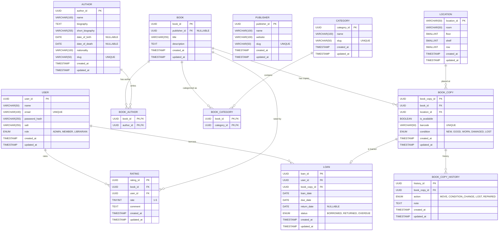

# BookWise - A library management system

BookWise is a library management system.

## ER Diagram

```mermaid
erDiagram
  USER {
    UUID user_id PK
    VARCHAR(50) name
    VARCHAR(100) email "UNIQUE"
    VARCHAR(255) password_hash
    VARCHAR(255) salt
    ENUM role "ADMIN, MEMBER, LIBRARIAN"
    TIMESTAMP created_at
    TIMESTAMP updated_at
  }

  CATEGORY {
    UUID category_id PK
    VARCHAR(100) name
    VARCHAR(50) slug "UNIQUE"
    TIMESTAMP created_at
    TIMESTAMP updated_at
  }

  AUTHOR {
    UUID author_id PK
    VARCHAR(100) name
    TEXT biography
    VARCHAR(255) short_biography
    DATE date_of_birth "NULLABLE"
    DATE date_of_death "NULLABLE"
    VARCHAR(100) nationality
    VARCHAR(50) slug "UNIQUE"
    TIMESTAMP created_at
    TIMESTAMP updated_at
  }

  PUBLISHER {
    UUID publisher_id PK
    VARCHAR(100) name
    VARCHAR(100) website
    VARCHAR(50) slug "UNIQUE"
    TIMESTAMP created_at
    TIMESTAMP updated_at
  }

  BOOK {
    UUID book_id PK
    UUID publisher_id FK "NULLABLE"
    VARCHAR(255) title
    TEXT description
    TIMESTAMP created_at
    TIMESTAMP updated_at
  }

  BOOK_AUTHOR {
    UUID book_id PK, FK
    UUID author_id PK, FK
  }

  BOOK_CATEGORY {
    UUID book_id PK, FK
    UUID category_id PK, FK
  }

  LOCATION {
    VARCHAR(50) location_id PK
    VARCHAR(50) room
    SMALLINT floor
    SMALLINT shelf
    SMALLINT row
    TIMESTAMP created_at
    TIMESTAMP updated_at
  }

  BOOK_COPY {
    UUID book_copy_id PK
    UUID book_id FK
    UUID location_id FK
    BOOLEAN is_available
    VARCHAR(50) barcode "UNIQUE"
    ENUM condition "NEW, GOOD, WORN, DAMAGED, LOST"
    TIMESTAMP created_at
    TIMESTAMP updated_at
  }

  BOOK_COPY_HISTORY {
    UUID history_id PK
    UUID book_copy_id FK
    ENUM action "MOVE, CONDITION_CHANGE, LOST, REPAIRED"
    TEXT note
    TIMESTAMP created_at
    TIMESTAMP updated_at
  }

  LOAN {
    UUID loan_id PK
    UUID user_id FK
    UUID book_copy_id FK
    DATE loan_date
    DATE due_date
    DATE return_date "NULLABLE"
    ENUM status "BORROWED, RETURNED, OVERDUE"
    TIMESTAMP created_at
    TIMESTAMP updated_at
  }

  RATING {
    UUID rating_id PK
    UUID book_id FK
    UUID user_id FK
    TINYINT rate "1-5"
    TEXT comment
    TIMESTAMP created_at
    TIMESTAMP updated_at
  }

  USER ||--o{ LOAN: "borrows"
  BOOK_COPY ||--o| LOAN: "is loaned"

  BOOK ||--o{ BOOK_AUTHOR: "has author"
  AUTHOR ||--o{ BOOK_AUTHOR: "writes"

  BOOK ||--o{ BOOK_CATEGORY: "categorized as"
  CATEGORY ||--o{ BOOK_CATEGORY: "contains"

  USER ||--o{ RATING: "rates"
  BOOK ||--o{ RATING: "rated by"

  BOOK ||--o{ BOOK_COPY: "has copies"
  LOCATION ||--o{ BOOK_COPY: "placed at"

  BOOK_COPY ||--o{ BOOK_COPY_HISTORY: "history"
```
